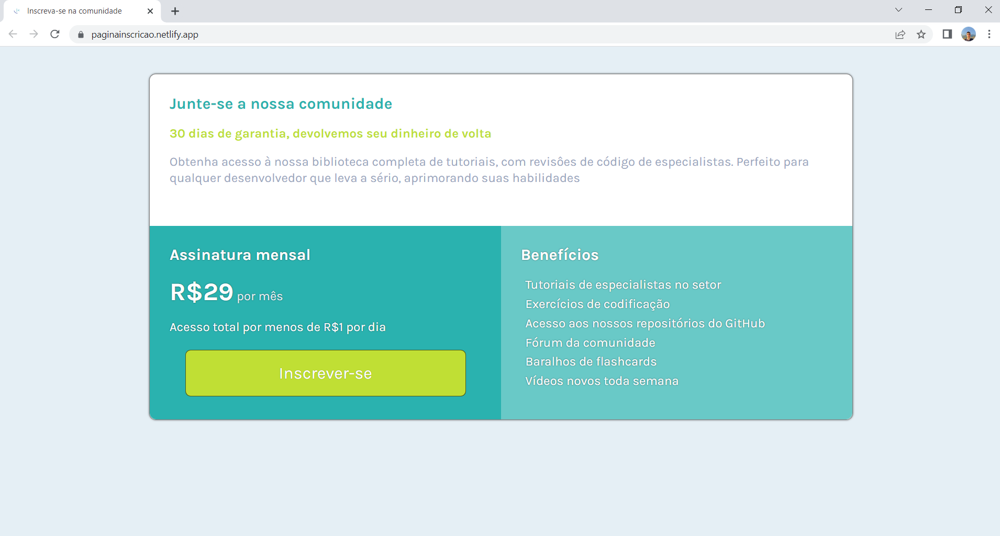
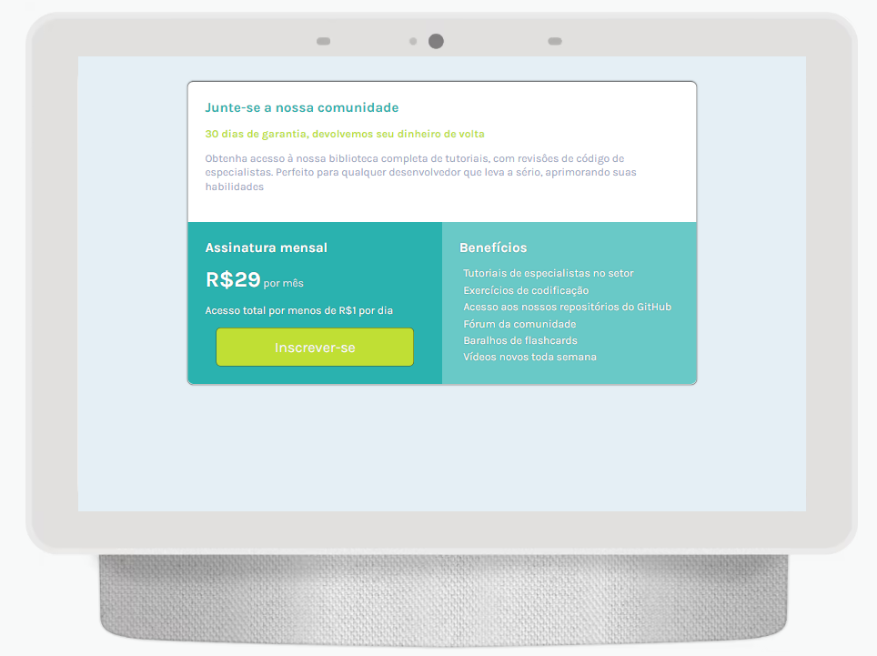
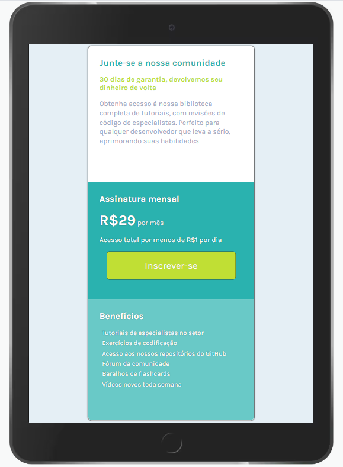
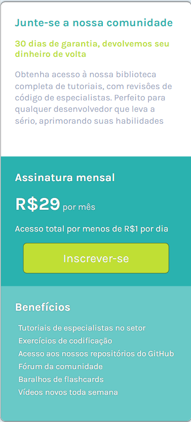

<h1 align="center">Landing page</h1>

Projeto de uma landing page responsiva usando mobile first, com as tecnoçogias HTML e CSS.

---

**
Sumário:
**

<a href="#sobre">Sobre</a> |
<a href="#funcionalidades">Funcionalidades</a> |
<a href="#tecnologias">Tecnologias</a> |
<a href="#serviços-usados">Serviços usados</a> |
<a href="#imagens">Imagens</a> |
<a href="#como-usar">Como usar</a> |
<a href="#pré-requisitos">Pré-requisitos</a> |
<a href="#links">Links</a> |
<a href="#autor">Autor</a>

## Sobre
Esse projeto teve como principal objetivo aplicar a resposividade, para o layout ficar ajustável a diversos dispositivos.

## Funcionalidades
A principal funcionalidade do projeto é:

✅ Layout resposivo a diversos tipos e tamanhos de tela.

## Tecnologias
* HTML5
* CSS3

## Serviços usados
* GitHub
* Netlify (hospedagem do site)

## Imagens

---

Layout em computadores

  

---

Layout em tablets

  

---

Layouts em smartphones

  

## Como usar
Basta abrir o link da página que ela será aberta no seu navegador.

## Pré requisitos
Para abrir a página, basta apenas o uso de um navegador de sua preferência.

## Links
* Deploy: https://paginainscricao.netlify.app/
* Repositório: https://github.com/CaioAugustoHD/Pagina-inscricao

## Autor
✨ Feito por Caio Augusto!!!

* caioaugustosbs@gmail.com
* <a href="https://www.linkedin.com/in/caio-augusto-cap/" target=”_blank”>LinkedIn</a>
* <a href="https://github.com/CaioAugustoHD" target=”_blank”>GitHub</a>
